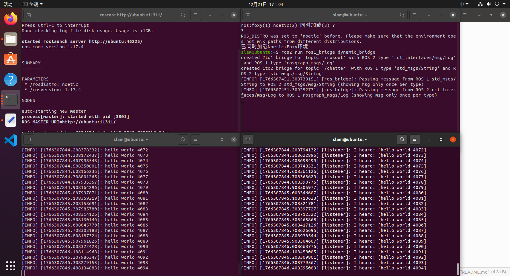
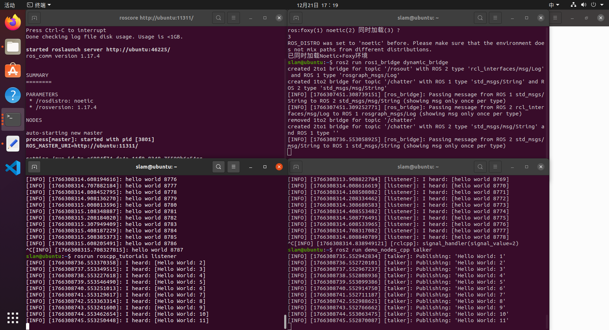

# offline_timestamp_align_mix

## 简介
一个帮助初学者熟悉ROS1和ROS2系统和时间标定的离线时间戳粗对齐项目,既可以只聚焦于单独的ROS系统对ROS1、ROS2进行学习，也可以通过桥接工具进行跨版本混合编译，提高问题排查能力和解决工程问题能力。

## 目录结构
```
offline_timestamp_align_mix_ws
   ├── ros1_ws
   │   └── src
   │       └── offline_timestamp_align
   │           ├── CMakeLists.txt
   │           ├── launch
   │           │   └── offline_timestamp_align.launch
   │           ├── msg
   │           │   └── FusedState.msg
   │           ├── package.xml
   │           └── src
   │               ├── cam_w_norm_calculate.cpp
   │               ├── fusion_node.cpp
   │               ├── imu_w_norm_calculate.cpp
   │               ├── publish_node.cpp
   │               ├── split.cpp
   │               ├── time_offset_calculate_norm.cpp
   │               ├── time_offset_calculate_portion.cpp
   │               └── timestamp_correct.cpp
   └── ros2_ws
       └── src
           └── offline_timestamp_align_colcon
               ├── CMakeLists.txt
               ├── launch
               │   ├── both_1.launch.py
               │   ├── both_2.launch.py
               │   ├── pub1_fus2.launch.py
               │   ├── pub2_fus1.launch.py
               │   └── split.launch.py
               ├── msg
               │   └── FusedState.msg
               ├── package.xml
               └── src
                   ├── cam_w_norm_calculate_colcon.cpp
                   ├── fusion_node_colcon.cpp
                   ├── imu_w_norm_calculate_colcon.cpp
                   ├── publish_node_colcon.cpp
                   ├── time_offset_calculate_norm_colcon.cpp
                   ├── time_offset_calculate_portion_colcon.cpp
                   └── timestamp_correct_colcon.cpp
```
    
## 文件功能简介    
### offline_timestamp_align (ROS1) 部分
CMakeLists.txt：声明编译规则  
package.xml：声明依赖和包的基本信息  
offline_timestamp_align.launch：一键启动ROS1系统内的发布和融合节点  
FusedState.msg：定义融合后发布的消息  
split.cpp：对ROS1格式bag文件进行拆解  
cam_w_norm_calculate.cpp：计算三轴视觉角速度及模值  
imu_w_norm_calculate.cpp：计算IMU角速度模值  
time_offset_calculate_norm.cpp：凭借角速度模值估算时间偏移  
time_offset_calculate_portion.cpp：凭借三轴角速度估算时间偏移  
timestamp_correct.cpp：时间戳修正  
publish_node.cpp：ROS1发布节点  
fusion_node.cpp：ROS1信息融合节点  

### offline_timestamp_align_colcon (ROS2) 部分
CMakeLists.txt：声明编译规则  
package.xml：声明依赖和包的基本信息  
FusedState.msg：定义融合后发布的消息  
cam_w_norm_calculate_colcon.cpp：计算三轴视觉角速度及模值  
imu_w_norm_calculate_colcon.cpp：计算IMU角速度模值  
time_offset_calculate_norm_colcon.cpp：凭借角速度模值估算时间偏移  
time_offset_calculate_portion_colcon.cpp：凭借三轴角速度估算时间偏移  
timestamp_correct_colcon.cpp：时间戳修正  
publish_node_colcon.cpp：ROS2发布节点  
fusion_node_colcon.cpp：ROS2信息融合节点  
both_1.launch.py：跨版本一键启动ROS1系统内的发布和融合节点  
both_2.launch.py：一键启动ROS2系统内的发布和融合节点  
pub1_fus2.launch.py：跨版本一键启动ROS1系统内的发布节点和ROS2系统内的融合节点  
pub2_fus1.launch.py：跨版本一键启动ROS2系统内的发布节点和ROS1系统内的融合节点  
split.launch.py：跨版本一键启动ROS1系统内对ROS1格式bag文件进行拆解的功能  

## 简单的ros1_bridge测试过程
1.打开1#终端，加载ROS1环境变量，然后执行命令：
```bash
roscore
```
2.打开2#终端，先加载ROS1环境变量，再加载ROS2环境变量，之后打开ros1_bridge所在的文件夹，执行命令：
```bash
cd ros1_bridge_ws
```
加载文件夹变量，执行命令：
```bash
source install/setup.bash
```
启动ros1_bridge，执行命令：
```bash
ros2 run ros1_bridge dynamic_bridge  
```
3.测试ROS1系统发布，ROS2系统订阅的跨版本通信过程：  
打开3#终端，加载ROS1环境变量，之后执行命令：
```bash
rosrun roscpp_tutorials talker  
```
打开4#终端，加载ROS2环境变量，之后执行命令：
```bash
ros2 run demo_nodes_cpp listener
```
测试成功示意图：


4.测试ROS2系统发布，ROS1系统订阅的跨版本通信过程：  
打开5#终端，加载ROS2环境变量，之后执行命令：
```bash
ros2 run demo_nodes_cpp talker
```
打开6#终端，加载ROS1环境变量，之后执行命令：
```bash
rosrun roscpp_tutorials listener
```
测试成功示意图：


注：
加载系统级别环境变量的命令：
```bash
source /opt/ros/foxy/setup.bash
source /opt/ros/noetic/setup.bash
```
